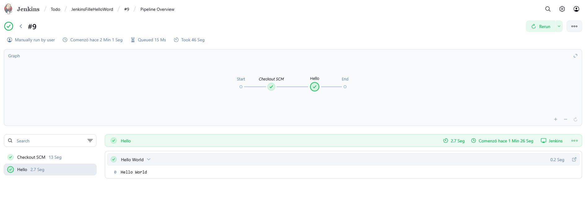

```markdown
# Semana 09


## Contenido


1. [Instalación de Jenkins](#instalación-de-jenkins)
2. [Pipeline básico "Hello World"](#pipeline-básico-hello-world)
3. [Balanceo de carga con NGINX para una API](#balanceo-de-carga-con-nginx-para-una-api)

---

## Instalación de Jenkins

Para instalar Jenkins, se requiere la creación de la carpeta `agent`, y dentro de ella el archivo `docker-compose.yaml`.

### Pasos para la instalación:

1. Ir al directorio `agent/`.
2. Ejecutar el siguiente comando:


```bash

  - docker compose up -d

3. Se abrirán las siguientes ventanas para la instalación y configuración de Jenkins:


Pipeline básico "Hello World"
Creamos un dentro de agent JenkingFileHelloWord 
Configuramos la pagina de Jenkins con el Token de GitHub mediante Pipeline Script from SCM 
Se sincronisara el nuevo Job en Jenkins llamado Hello World, utilizando la opción Pipeline.


El archivo Jenkinsfile debe estar en su repositorio, en un apartado específico.



# Balanceo de carga con NGINX para una API
Requisitos
- Una API REST en el lenguaje de tu preferencia.
- Uso de NGINX como balanceador de carga con la estrategia least_conn
# Paso 1: Crear dos instancias de la API
Ejecuta los siguientes comandos:
    - docker build -t lab09:api .
    - docker run -itd -p 4007:3000 lab09:api
    - docker run -itd -p 4008:3000 lab09:api

# Paso 2: Configurar NGINX como balanceador de carga
- Se utiliza la estrategia least_conn, la cual redirige las solicitudes al backend con la menor cantidad de conexiones activas.


# Paso 3: Aplicar y verificar la configuración
Para recargar la configuración de NGINX:
        - docker exec -it nginx-balancer nginx -s reload
Para verificar que el balanceo esté funcionando, revisa los logs:
        - docker exec -it nginx-balancer tail -f /var/log/nginx/backend-access.log
    
